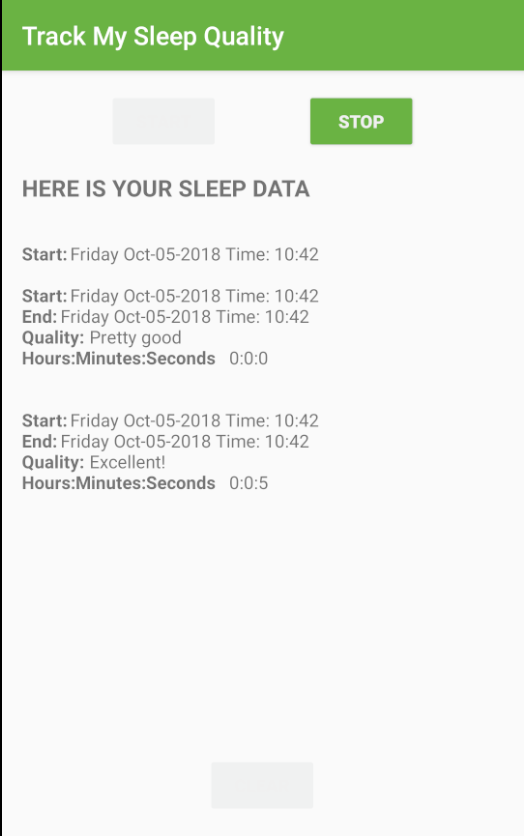

# Sleep Tracker — Android Kotlin M4

**STEP IT Academy** — Android Mobile Application Development (Kotlin + XML UI)
> Module 4 — Room: Database, DAO, Coroutines, ViewModel, LiveData, DataBinding

---

## Screenshots





---

## About

Sleep Tracker is a demo app that records your sleep sessions — start time, end time, and sleep quality. All data is persisted locally using Room database. The UI reacts to database changes in real-time through LiveData and DataBinding.

---

## Architecture

Pattern: **MVVM** (Model-View-ViewModel)

```
UI (Fragment + DataBinding)
        │
        ▼
  ViewModel  ──────────────────► Direct DAO access
        │                                │
        │                                ▼
   LiveData                       Room Database
   Coroutines                     (SleepNight Entity + DAO)
```

Key concepts:
- **Room** — Entity, DAO, Database singleton
- **Coroutines** — `viewModelScope.launch` for all DB operations
- **LiveData** — observe DB changes, drive button states
- **LiveData.map** — transform raw data for display
- **DataBinding** — bind ViewModel data and click handlers directly in XML
- **Navigation SafeArgs** — pass `nightId` between fragments

---

## Project Structure

```
app/src/main/java/com/example/android/trackmysleepquality/
├── MainActivity.kt
├── Util.kt                              # formatNights(), convertLongToDateString()
├── database/
│   ├── SleepNight.kt                   # @Entity
│   ├── SleepDatabaseDao.kt             # @Dao
│   └── SleepDatabase.kt                # @Database singleton
├── sleeptracker/
│   ├── SleepTrackerFragment.kt
│   ├── SleepTrackerViewModel.kt
│   └── SleepTrackerViewModelFactory.kt
└── sleepquality/
    ├── SleepQualityFragment.kt
    ├── SleepQualityViewModel.kt
    └── SleepQualityViewModelFactory.kt
```

---

## Tech Stack

| Library | Version |
|---|---|
| Android Gradle Plugin | 9.0.1 |
| Kotlin (bundled with AGP) | — |
| AndroidX Core KTX | 1.18.0 |
| AppCompat | 1.7.1 |
| ConstraintLayout | 2.2.1 |
| Navigation Component | 2.9.7 |
| Lifecycle ViewModel + LiveData | 2.9.0 |
| Room | 2.7.1 |
| Coroutines (Android) | 1.10.2 |
| Material Components | 1.13.0 |

---

## Build Requirements

| Tool | Version |
|---|---|
| Android Gradle Plugin | 9.0.1 |
| Gradle Wrapper | 9.2.1 |
| JDK | 21 |
| Min SDK | 24 |
| Target SDK | 36 |
| Compile SDK | 36 |

**JDK setup in Android Studio:**
`File → Settings → Build, Execution, Deployment → Build Tools → Gradle → Gradle JDK` → select **Embedded JDK**

---

## How to Work with This Repo

### Branch structure

| Branch | Purpose |
|---|---|
| `main` | Complete solution — all steps finished |
| `Step.XX-Exercise-<topic>` | Starting point with TODOs for the student |
| `Step.XX-Solution-<topic>` | Reference answer for the step |

### Workflow per step

1. Check out the Exercise branch for the step you are working on
2. Find and complete all `// TODO` comments in Android Studio (View → Tool Windows → TODO)
3. Compare your result with the corresponding Solution branch
4. Move on to the next step

```bash
git checkout Step.01-Exercise-Create-Night-Data-Entity
```

---

## Exercise Steps

| Step | Branch | Topic | Key Files |
|---|---|---|---|
| 01 | `Step.01-Exercise-Create-Night-Data-Entity` | Create Room Entity | `SleepNight.kt` |
| 02 | `Step.02-Exercise-Create-SleepDatabaseDao` | Create DAO | `SleepDatabaseDao.kt` |
| 03 | `Step.03-Exercise-Create-RoomDatabase` | Create Database | `SleepDatabase.kt` |
| 04 | `Step.04-Exercise-Add-ViewModel` | Add ViewModel | `SleepTrackerViewModel.kt` |
| 05 | `Step.05-Exercise-Coroutines` | Add Coroutines | `SleepTrackerViewModel.kt` |
| 06 | `Step.06-Exercise-Record-SleepQuality` | Record Sleep Quality | `SleepQualityViewModel.kt`, `SleepQualityFragment.kt` |
| 07 | `Step.07-Exercise-Add-Button-States-and-SnackBar` | Button States + SnackBar | `SleepTrackerViewModel.kt`, `fragment_sleep_tracker.xml` |

---

## Navigation Flow

```
SleepTrackerFragment
        │
        │ onStopTracking() → navigate with nightId (SafeArgs)
        ▼
SleepQualityFragment
        │
        │ onSetSleepQuality() → navigate back
        ▼
SleepTrackerFragment
```

---

## Course Info

- **Academy:** STEP IT Academy — Cambodia
- **GitHub Org:** chamkartechcambodia-sudo
- **Course:** Android Mobile Application Development (Kotlin + XML UI)
- **Module:** M4 — Room (Day 17–18)
- **Instructor:** Magn
